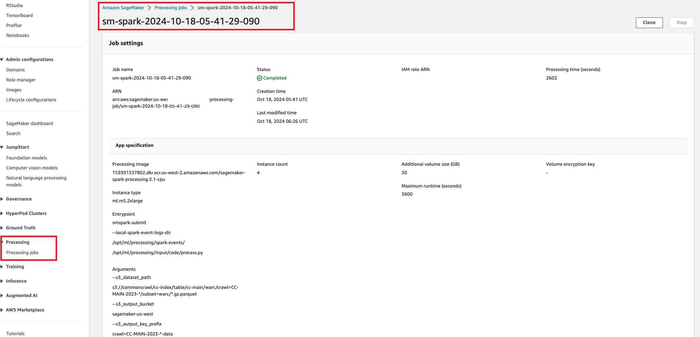

Running Spark in SageMaker Studio Notebook
================

Amazon SageMaker Processing Jobs are used to analyze data and evaluate machine learning models on Amazon SageMaker. With Processing, you can use a simplified, managed experience on SageMaker to run your data processing workloads, such as feature engineering, data validation, model evaluation, and model interpretation. You can also use the Amazon SageMaker Processing APIs during the experimentation phase and after the code is deployed in production to evaluate performance.

In this repository, you will learn how to use [Spark]([dask.org](https://spark.apache.org/)) for data analytics in an Amazon SageMaker Studio Notebook. 

## Setting up Spark

All steps to install Spark are included in the notebook code itself, so nothing needs to be done outside of the notebook code. The following code snippet is just included here for reference, it is run as part of the notebook code.

```{{python}}
# Setup - Run only once per Kernel App
%conda install https://anaconda.org/conda-forge/openjdk/11.0.1/download/linux-64/openjdk-11.0.1-hacce0ff_1021.tar.bz2

# install PySpark
%pip install pyspark==3.4.0

# restart kernel
from IPython.core.display import HTML
HTML("<script>Jupyter.notebook.kernel.restart()</script>")
```

## Workflow: Processing large datasets with Apache Spark and Amazon SageMaker

1. Open the [`spark_on_sm_processing_job.ipynb`](spark_on_sm_processing_job.ipynb) notebook. Run the notebook on a `Python 3` kernel on a `ml.r5.xlarge` instance.

2. Click `run all cells`. This notebook processes the Common Crawl dataset made available by AWS on S3. The Common Crawl dataset is a corpus of web crawl data composed of over 50 billion web pages.

3. Perform some data analytics and then submit the processing code [here](code/process.py) to the SageMaker Processing Job's [`PySparkProcessor`](https://sagemaker.readthedocs.io/en/stable/amazon_sagemaker_processing.html#pysparkprocessor).

_**Once the processing job completes, you can check the actual processing time for which your account will be billed in the SageMaker Processing Job details as shown in the screenshot below.**_



